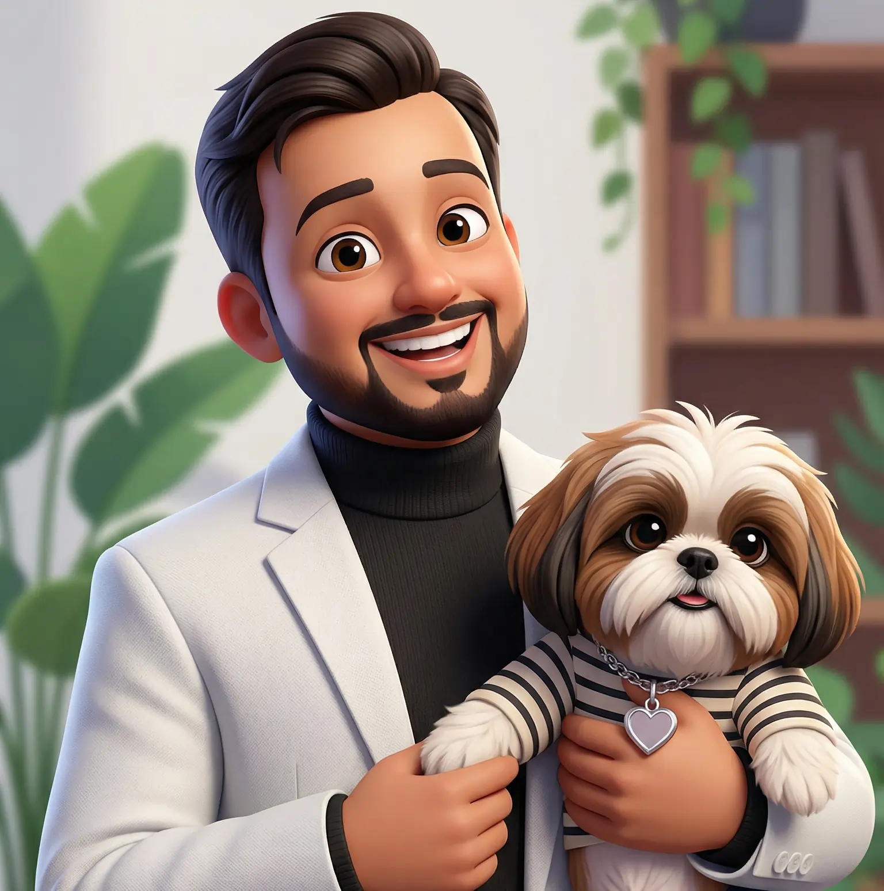

# 🚀 Animesh Srivastava | Master Portfolio

[](https://animeshsrivastava.vercel.app)

A high-performance, **futuristic digital ecosystem** built with the latest React 19 and Next.js 16 metadata patterns. This portfolio represents the intersection of robust engineering and avant-garde design, featuring liquid glassmorphism, real-time data integration, and physics-based interactions.

---

## ✨ Key Features

- **⚛️ Bleeding Edge Stack:** Built with **React 19** and **Next.js 16 (App Router)** for peak performance and instantaneous page transitions using Turbopack.
- **🎨 Tailwind CSS v4:** Leveraging the latest CSS-first framework for a modern, high-speed design system.
- **📈 Real-time Analytics:** 
  - **DSA Progress:** Automated fetching of LeetCode statistics.
  - **Engagement:** Integrated Vercel Analytics and Google Tag Manager.
- **🎭 Motion Mastery:** 
  - Advanced **Framer Motion** orchestrations for layout transitions.
  - **Matter.js** integration for physics-based interactive elements.
  - Customizable Lottie animations for high-fidelity micro-interactions.
- **📩 Enterprise-Grade Contact System:** Server-side email processing via **Resend** with sleek toast notifications by `sonner`.
- **📱 Fluid Responsiveness:** Optimized for every viewport, from ultra-wide monitors to mobile devices.
- **🌑 Intelligent Theming:** System-aware Dark/Light mode with seamless transitions.

---

## 🛠️ Technology Stack

| Layer | Technologies |
| :--- | :--- |
| **Frontend** | React 19, Next.js 16 (App Router), TypeScript |
| **Styling** | Tailwind CSS v4, Framer Motion, Lucide Icons |
| **Backend** | Next.js Server Actions, Resend API |
| **Animation** | Matter.js (Physics), Lottie React, CSS Glassmorphism |
| **Deployment** | Vercel (CI/CD), Bun (Runtime/Pkg Manager) |

---

## 📂 Architecture

```text
src/
├── app/             # Next.js App Router (Layouts, Pages, API)
├── components/      # Atomic Design structure
│   ├── animations/  # Physics (Matter.js) & Motion wrappers
│   ├── common/      # Global Layout UI (Navbar, Glow effects)
│   ├── projects/    # Feature-specific case studies
│   └── sections/    # Modular landing page blocks
├── data/            # Static & dynamic configuration (basicDetails, etc.)
├── hooks/           # Custom React hooks for glass effects & scroll
└── lib/             # Server actions & Utility functions
```

---

## 🚀 Rapid Development

### Prerequisites
- **Bun** (Required for the fastest build times)

### Installation

1. **Clone & Enter:**
   ```bash
   git clone https://github.com/animeshsrivastava246/animeshsrivastava.git
   cd animeshsrivastava
   ```

2. **Zero-Config Install:**
   ```bash
   bun install
   ```

3. **Environment Setup:**
   Create a `.env` file in the root:
   ```env
   # Email System
   RESEND_API_KEY="re_..."
   EMAIL_ID="your@email.com"

   # Analytics
   NEXT_PUBLIC_GTM_ID="GTM-..."
   ```

4. **Ignite Development:**
   ```bash
   bun dev
   ```

---

## 📦 Production Ready

| Command | Action |
| :--- | :--- |
| `bun run build` | Compiles an optimized production bundle |
| `bun run start` | Boots the high-performance production server |
| `bun run lint`  | Executes strict TypeScript & ESLint checks |

---

## 🤝 Let's Connect

Architecting elegance and engineering scale for the modern web.

- **Portfolio:** [animeshsrivastava.vercel.app](https://animeshsrivastava.vercel.app)
- **LinkedIn:** [Animesh Srivastava](https://www.linkedin.com/in/animesh246/)
- **GitHub:** [@animeshsrivastava246](https://github.com/animeshsrivastava246)
- **Email:** [animeshsrivastava246246@gmail.com](mailto:animeshsrivastava246246@gmail.com)

---

<div align="center">
  <sub>Built with ☕, Matter.js, and plenty of Framer Motion magic. © 2025 Animesh Srivastava</sub>
</div>
